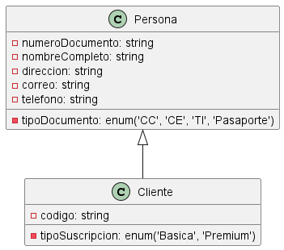

# Proyecto para la gestión de biblioteca.

**Descripción** El siguiente proyecto pretende establecer los requerimientos para construir el poryecto de gestión de bibloteca. 

## Requerimientos Funcionales

1. **`RF1: `** Gestionar la `CRUD` para el formulario persona.
    - **Descripcion:** Se requiere gestionar  la infomración de los datos básicos de las personas que intervienten en el proceso, incluye, clientes, biblotecario o usuario adminsitrador.
    - **Datos de entrada:** Para generar la CRUD, se requiere los siguientes datos. 
        - `Tipo de documento`
        - `Número de documento`
        - `Nombre completo`
        - `Dirección`
        - `Correo electrónico`
        - `Número de teléfono/celular`
    - **Procespo:** La persona debe tener acceso al sistema, se autentica con usuario y contraña. Dependiendo de rol que tenga el sistema, este procederá en habilitar los permisos
    - **Precondiciones:** Para realizar la gestión de la CRUD del formulario persona, se requiere:
        - Autenticarse en el sistema.
        - Gestionar los registros 
    - **Poscondiciones:**
        - Autenticarse en el sistema.
            1. Ingresar usario y contraseña. Se procede a generar acceso al sistema. 
            2. Ingresar usario y contraseña. Degenegar acceso al sistema por error de datos.
            3. Ingresar usario y contraseña. Degenegar acceso al sistema por usuario inhabilitado.            
        - Gestionar registros
            1. `Administrador:` Puede adminsitrar la información de bibliotecarios y clientes.
            2. `Bibliotecólogo:` Puede adminsitrar la información propia o las de los clientes.
            3. `Cliente:` Puede administrar únicamente la información de su propio registro (perfil).
        
        - **Caso de uso**: 

2. **`RF2: `** Gestionar la `CRUD` para el formulario cliente.
    - **Descripcion:** Se requiere gestionar  la infomración de los datos básicos de los clientes que intervienten en el proceso, incluye, `FR1`
    - **Datos de entrada:** Para generar la CRUD, se requiere los siguientes datos. 
        - `Código de cliente`
        - `Tipo de suscripción`
    - **Precondiciones:** Para realizar la gestión de los servicios que tiene acceso. Requiere:
    - **Proceso:** La cliente debe estar registrado como persona en el sistema `RF1`, luego estar asociado a un tipo de suscripción que tiene establecido la biblioteca.    
        1. Elergir suscripción
        2. Servicios de biblioteca
            - Realizar préstamo de libros
            - Realizar devolución de libros
            - Realizar ampliación de préstamo de libros
    - **Poscondiciones:**
        1. Elegir suscripción
            1. Ver tipos de suscripción
            2. Establecer la suscripción acorde a su necesidad. 
            3. Sitema no le permite asociarse a suscripción por no cumplir con requisitos del sistema.            
        - Servicios de biblioteca
            1. `Realizar préstamo de libros:` 
                - Sistema permite prétamo de libro
                - Sistema rechaza préstamo de libro
            2. `Realizar devolución de libros:` 
                - Sistema permite devolución de libro
                - Sistema rechaza devolución de libro
            3. `Realizar ampliación de préstamo de libros:` 
                - Sistema permite apliación de devolución de libro
                - Sistema rechaza apliación de devolución de libro
        
        - **Caso de uso**: 

        - **Diagrama de clase:** Representa el sistema de información a nivel estructural.
        
            

## Requerimientos No Funcionales